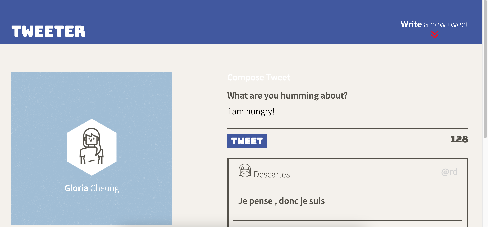

# Tweeter Project

Tweeter is a simple, single-page Twitter clone.

This web application is focused on developing front end skills such as HTML, CSS, JS, jQuery and AJAX. Users are able to view current tweets and post new tweets using this app.

Deployed [here](https://tweeterclone-app.herokuapp.com/)

## Final Product

Desktop View of Posted Tweets:

Desktop View of Creating New Tweet:

Desktop View of New Tweet Posted:

Mobile View of Creating New Tweet:

## Getting Started

1. Install dependencies using the `npm install` command.
2. Start the web server using the `npm start` command. The app will be served at <http://localhost:8080/>.
3. Go to <http://localhost:8080/> in your browser.
4. Create new tweet by clicking on the "Write a new tweet" button

## Dependencies

- Express
- Node.js
- Body-parser
- Chance
- Md5
